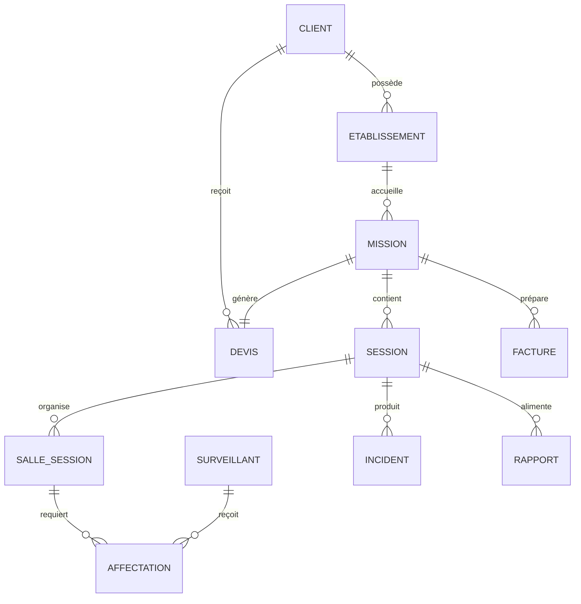

# SPC Product Bible
## Enterprise Edition — Version 1.0
### Plateforme intelligente de pilotage des examens et des surveillants

**Statut :** Référence produit, métier, design, technique et qualité  
**Périmètre :** SaaS SPC — missions, devis, salles, sessions d’examens, surveillants, planning, rapports et facturation  
**Public :** Product Owner, directions opérationnelles, développeurs, designers, QA, Claude Code, Codex et futurs partenaires techniques  
**Dernière mise à jour :** Juillet 2026

---

> **Objectif de cette Product Bible**  
> Garantir que chaque évolution de SPC améliore le produit sans casser les workflows, les calculs, les données, la lisibilité ou l’expérience utilisateur.  
> Ce document est la source de vérité de référence. En cas de conflit entre une demande ponctuelle et cette Bible, la demande doit être analysée, justifiée et intégrée à la Bible avant d’être développée.

---

# Table des matières

1. [Résumé exécutif](#1-résumé-exécutif)
2. [Vision, mission et positionnement](#2-vision-mission-et-positionnement)
3. [ADN et principes non négociables](#3-adn-et-principes-non-négociables)
4. [Utilisateurs, rôles et personas](#4-utilisateurs-rôles-et-personas)
5. [Périmètre fonctionnel et architecture de l’information](#5-périmètre-fonctionnel-et-architecture-de-linformation)
6. [Workflow opérationnel de référence](#6-workflow-opérationnel-de-référence)
7. [Modèle de données métier](#7-modèle-de-données-métier)
8. [Règles métier fondamentales](#8-règles-métier-fondamentales)
9. [Moteur de calcul financier](#9-moteur-de-calcul-financier)
10. [Spécifications des modules](#10-spécifications-des-modules)
11. [UX Bible](#11-ux-bible)
12. [UI Bible et Design System](#12-ui-bible-et-design-system)
13. [Tableaux métier et visibilité des données](#13-tableaux-métier-et-visibilité-des-données)
14. [Persistance, intégrité et traçabilité](#14-persistance-intégrité-et-traçabilité)
15. [Rôles, permissions, sécurité et RGPD](#15-rôles-permissions-sécurité-et-rgpd)
16. [Architecture technique de référence](#16-architecture-technique-de-référence)
17. [Qualité, tests et non-régression](#17-qualité-tests-et-non-régression)
18. [Performance, accessibilité et exploitation](#18-performance-accessibilité-et-exploitation)
19. [IA, automatisation et intelligence opérationnelle](#19-ia-automatisation-et-intelligence-opérationnelle)
20. [Pilotage produit, indicateurs et analytics](#20-pilotage-produit-indicateurs-et-analytics)
21. [Roadmap produit](#21-roadmap-produit)
22. [Gouvernance produit et règles d’évolution](#22-gouvernance-produit-et-règles-dévolution)
23. [Master Prompt pour Claude Code et Codex](#23-master-prompt-pour-claude-code-et-codex)
24. [Glossaire SPC](#24-glossaire-spc)
25. [Annexes : check-lists opérationnelles](#25-annexes--check-lists-opérationnelles)

---

# 1. Résumé exécutif

## 1.1. Définition de SPC

**SPC** est une plateforme SaaS de pilotage opérationnel des examens et des surveillants. Elle structure, automatise et sécurise un processus généralement dispersé entre tableaux Excel, e-mails, appels téléphoniques et documents PDF.

SPC ne se limite pas à « créer un planning ». La plateforme relie les dimensions opérationnelles, financières et humaines d’une mission :

```text
Demande client
→ Mission
→ Planification des salles
→ Horaires et besoins humains
→ Calcul exact des heures facturables
→ Devis HT / TVA / TTC
→ Acceptation
→ Planning des surveillants
→ Validation opérationnelle
→ Exécution terrain
→ Rapport post-session
→ Facturation
```

## 1.2. Problèmes résolus

SPC doit réduire :

- les erreurs de calcul d’heures ;
- les oublis de salles ou de surveillants ;
- les doubles affectations ;
- les plannings illisibles ;
- les changements non tracés ;
- les écarts entre devis, planning et réalité terrain ;
- les pertes de données ;
- les retards de confirmation ;
- l’absence de visibilité sur la rentabilité d’une mission.

## 1.3. Valeur apportée

Pour les établissements et sociétés de surveillance, SPC doit offrir :

- une **vision unique et fiable** de chaque mission ;
- des **calculs de facturation transparents** ;
- un **planning opérationnel immédiatement exploitable** ;
- une **traçabilité des décisions et changements** ;
- une réduction des erreurs humaines ;
- une amélioration de la réactivité en cas d’imprévu ;
- une expérience premium et rassurante pour les utilisateurs métier.

---

# 2. Vision, mission et positionnement

## 2.1. Vision

Devenir la plateforme de référence pour organiser, sécuriser et piloter les opérations d’examens, depuis la demande client jusqu’à la facturation et au retour qualité.

## 2.2. Mission

Permettre aux équipes de gestion d’examens de créer, planifier, vérifier, exécuter et facturer des missions complexes avec un haut niveau de fiabilité opérationnelle.

## 2.3. Positionnement

SPC est une **Exam Operations Management Platform**.

Il se situe à l’intersection de :

- la planification de ressources humaines ;
- la gestion de missions ;
- le pilotage des examens ;
- la génération de devis ;
- la gestion d’incidents ;
- le reporting opérationnel.

## 2.4. Promesse produit

> **SPC transforme la planification réelle des examens en devis fiables, en plannings exploitables et en opérations traçables.**

## 2.5. Différenciation attendue

SPC se différencie par :

1. Le lien natif **salles → horaires → surveillants → heures facturables → devis**.
2. La gestion précise des contraintes de terrain : PMR, tiers-temps, renfort, horaires décalés, multi-sites.
3. La transformation directe d’un devis accepté en planning opérationnel.
4. La traçabilité des modifications de session.
5. La lisibilité extrême des tableaux métier.
6. Une future couche d’intelligence pour suggérer les meilleures affectations et détecter les risques.

---

# 3. ADN et principes non négociables

## 3.1. Principes directeurs

1. **Une seule source de vérité par donnée.**  
   Une donnée de salle, d’horaire ou de surveillant ne doit pas exister dans plusieurs états indépendants sans synchronisation.

2. **La planification réelle pilote le calcul financier.**  
   Aucun devis ne doit reposer sur une estimation vague lorsque les salles, horaires et effectifs sont connus.

3. **Le terrain prime sur l’apparence.**  
   Un écran doit d’abord être exploitable en conditions réelles avant d’être décoratif.

4. **Aucune donnée importante ne doit disparaître.**  
   Toute modification doit être persistée et retrouvable.

5. **Tout calcul métier doit être explicite.**  
   Les formules, coefficients et arrondis doivent être lisibles et vérifiables.

6. **Toute action critique doit être traçable.**  
   Validation, modification, affectation, annulation et recalcul doivent être horodatés.

7. **La clarté visuelle est une exigence fonctionnelle.**  
   Une colonne ou une information illisible est un défaut produit.

8. **Les automatisations doivent être explicables.**  
   Une suggestion d’affectation doit toujours indiquer ses critères principaux.

## 3.2. Ce que SPC ne doit jamais devenir

- un simple tableau de bord décoratif ;
- un ensemble de formulaires non reliés ;
- un outil où les données sont dupliquées ou perdent leur cohérence ;
- un produit qui privilégie la complexité technique au détriment de l’utilisateur métier ;
- un système où l’utilisateur doit « deviner » les calculs ou les statuts.

---

# 4. Utilisateurs, rôles et personas

## 4.1. Responsable examens / coordinateur opérationnel

**Objectif :** organiser une session fiable, complète et validée.  
**Besoins :**

- créer rapidement une mission ;
- visualiser toutes les salles et tous les horaires ;
- détecter les manques de surveillants ;
- modifier une session sans perdre les données ;
- produire un planning clair.

**Irritants :**

- Excel et e-mails dispersés ;
- appels de dernière minute ;
- changements mal tracés ;
- plannings tronqués ou difficiles à lire.

## 4.2. Responsable planning

**Objectif :** affecter les bonnes personnes, au bon endroit, au bon moment.  
**Besoins :**

- liste fiable de surveillants ;
- disponibilités visibles ;
- détection de conflit ;
- ajout rapide de renfort ;
- suivi des confirmations.

## 4.3. Responsable financier / administratif

**Objectif :** sécuriser le devis et la facturation.  
**Besoins :**

- heures calculées exactement ;
- détail HT, TVA, TTC ;
- coefficient clairement appliqué ;
- frais visibles ;
- justification de chaque montant.

## 4.4. Chef de centre / responsable de site

**Objectif :** exécuter la mission sans incident.  
**Besoins :**

- planning lisible ;
- contacts surveillants ;
- salles et horaires exacts ;
- alertes PMR / tiers-temps ;
- traitement rapide d’un incident.

## 4.5. Surveillant

**Objectif :** savoir quoi faire, où et quand.  
**Besoins :**

- mission claire ;
- horaires ;
- salle ;
- statut de confirmation ;
- contact du responsable ;
- possibilité de signaler une indisponibilité ou un incident.

## 4.6. Administrateur SPC

**Objectif :** administrer les données, les droits, les référentiels et la qualité globale.

---

# 5. Périmètre fonctionnel et architecture de l’information

## 5.1. Modules principaux

```text
Dashboard
├── Devis
├── Nouvelles missions
├── Planification des surveillants
├── Sessions d’examens
├── Superviseurs / Surveillants
├── Rapports post-session
├── Facturation
├── Clients & établissements
└── Paramètres
```

## 5.2. Navigation cible

| Module | Finalité principale |
|---|---|
| Dashboard | Visualiser la santé opérationnelle et financière du portefeuille de missions |
| Devis | Créer, consulter, envoyer, accepter, dupliquer et archiver les devis |
| Nouvelles missions | Créer une mission à partir de la planification réelle des salles |
| Planification | Affecter les surveillants, suivre les heures, valider et modifier les sessions |
| Sessions | Consulter l’état opérationnel de chaque session et son historique |
| Superviseurs | Gérer le référentiel des surveillants, disponibilités et informations |
| Rapports | Produire le retour post-session, incidents et synthèses |
| Facturation | Préparer les éléments de facturation à partir du réalisé validé |
| Paramètres | Configurer taux, TVA, rôles, modèles, règles et référentiels |

## 5.3. Architecture relationnelle simplifiée



---

# 6. Workflow opérationnel de référence

## 6.1. Workflow macro

```mermaid
flowchart LR
    A[Demande client] --> B[Nouvelle mission]
    B --> C[Planification des salles]
    C --> D[Horaires par salle]
    D --> E[Nombre de surveillants par salle]
    E --> F[Calcul exact des heures]
    F --> G[Devis HT / TVA / TTC]
    G --> H{Devis accepté ?}
    H -- Non --> I[Modifier / relancer / archiver]
    H -- Oui --> J[Générer planning]
    J --> K[Affecter surveillants]
    K --> L[Contrôles de cohérence]
    L --> M[Valider session]
    M --> N[Confirmer J-48]
    N --> O[Exécuter mission]
    O --> P[Rapport post-session]
    P --> Q[Facturation]
```



## 6.2. États de mission

| État | Description | Actions autorisées |
|---|---|---|
| Brouillon | Mission en cours de création | Modifier, supprimer, sauvegarder |
| À chiffrer | Salles/horaire incomplets ou prêts pour calcul | Modifier, calculer |
| Devis préparé | Devis généré mais non envoyé | Modifier, envoyer |
| Devis envoyé | Attente client | Dupliquer, relancer, annuler |
| Acceptée | Devis accepté | Générer planning |
| Planifiée | Planning créé | Affecter, modifier, valider |
| Validée | Session opérationnelle validée | Modifier sous contrôle, revalider |
| En cours | Mission en exécution | Suivre, déclarer incident |
| Terminée | Mission achevée | Créer rapport, préparer facture |
| Facturée | Facture préparée ou émise | Consulter, exporter |
| Archivée | Mission clôturée | Consultation seule selon droits |
| Annulée | Mission annulée | Consultation et traçabilité |

## 6.3. Règle de transition

Une transition d’état doit être :

- contrôlée ;
- journalisée ;
- réversible uniquement si les droits le permettent ;
- accompagnée d’une vérification des données nécessaires.

---

# 7. Modèle de données métier

## 7.1. Entités de référence

### Client

| Champ | Type | Requis | Règle |
|---|---|---:|---|
| id | UUID | Oui | Identifiant unique |
| raisonSociale | string | Oui | Non vide |
| contactPrincipal | string | Non | Recommandé |
| email | string | Non | Validation e-mail |
| téléphone | string | Non | Format contrôlé |
| adresseFacturation | string | Non | Pour documents financiers |
| statut | enum | Oui | Actif, prospect, archivé |

### Mission

| Champ | Type | Requis | Règle |
|---|---|---:|---|
| id | UUID | Oui | Unique |
| référence | string | Oui | Unique, générée ou contrôlée |
| clientId | UUID | Oui | Référence client |
| établissementId | UUID | Oui | Référence établissement |
| nom | string | Oui | Lisible et métier |
| dateDébut | date | Oui | >= date création sauf exception |
| dateFin | date | Oui | >= dateDébut |
| joursRetenus | decimal | Oui | Calculé et modifiable selon droits |
| statut | enum | Oui | Voir workflow |
| tauxHoraire | decimal | Oui | >= 0 |
| coefficientAjustement | decimal | Oui | Par défaut 1.00 |
| tauxTVA | decimal | Oui | Paramétrable, souvent 0.20 |

### Session

Une mission peut contenir une ou plusieurs sessions, notamment une session principale et des sessions complémentaires.

| Champ | Type | Requis | Règle |
|---|---|---:|---|
| id | UUID | Oui | Unique |
| missionId | UUID | Oui | Référence mission |
| nom | string | Oui | Exemple : Session principale |
| date | date | Oui | Dans la plage de mission |
| statut | enum | Oui | Brouillon à archivée |
| validéeLe | datetime | Non | Renseignée à validation |
| validéePar | UUID | Non | Utilisateur validateur |
| notes | text | Non | Observations internes |

### Salle de session

| Champ | Type | Requis | Règle |
|---|---|---:|---|
| id | UUID | Oui | Unique |
| sessionId | UUID | Oui | Référence session |
| période | enum | Oui | Matin ou après-midi |
| codeSalle | string | Oui | Alphanumérique, 6 caractères maximum |
| libellé | string | Non | Optionnel |
| étudiants | integer | Oui | >= 0 |
| surveillantsRequis | integer | Oui | >= 0 |
| pmr | boolean | Oui | Par défaut false |
| tiersTemps | boolean | Oui | Par défaut false |
| heureDébut | time | Oui | Format HH:mm |
| heureFin | time | Oui | > heureDébut |
| observations | text | Non | Lisible en planning |
| renfortRequis | boolean | Oui | Par défaut false |

### Surveillant

| Champ | Type | Requis | Règle |
|---|---|---:|---|
| id | UUID | Oui | Identifiant stable |
| prénom | string | Oui | Modifiable, non vide |
| nom | string | Oui | Modifiable, non vide |
| email | string | Non | Format e-mail |
| téléphone | string | Non | Format contrôlé |
| rôle | enum | Oui | Surveillant, volant, responsable, renfort |
| disponibilitéMatin | enum | Oui | Disponible, indisponible, à confirmer |
| disponibilitéAprèsMidi | enum | Oui | Disponible, indisponible, à confirmer |
| statut | enum | Oui | Actif, inactif, à vérifier |
| zone | string | Non | Zone géographique |
| observations | text | Non | Informations internes |

### Affectation

| Champ | Type | Requis | Règle |
|---|---|---:|---|
| id | UUID | Oui | Unique |
| sessionId | UUID | Oui | Référence session |
| salleSessionId | UUID | Oui | Référence salle |
| surveillantId | UUID | Oui | Référence surveillant |
| rôle | enum | Oui | Peut surcharger le rôle par défaut |
| statut | enum | Oui | À confirmer, confirmé, absent, remplacé |
| heuresPrévisionnelles | decimal | Oui | Calculé depuis salle/horaire |
| heuresRéelles | decimal | Non | Renseigné après mission |
| notes | text | Non | Observations d’affectation |

---

# 8. Règles métier fondamentales

## 8.1. Règles salles

1. Une salle doit être associée à une session et une période : matin ou après-midi.
2. Une salle du matin et une salle de l’après-midi peuvent porter le même code sans être la même ligne de donnée.
3. Chaque salle doit posséder :
   - un code ;
   - un horaire de début ;
   - un horaire de fin ;
   - un nombre d’étudiants ;
   - un nombre de surveillants requis.
4. Le code de salle doit être alphanumérique et limité à 6 caractères, sauf règle future explicitement validée.
5. Une heure de fin antérieure ou égale à l’heure de début rend la salle invalide.
6. Les données matin et après-midi ne doivent jamais s’écraser mutuellement.
7. La suppression d’une salle doit déclencher une confirmation et signaler l’impact éventuel sur le devis ou le planning.

## 8.2. Règles surveillants

1. Prénom et nom doivent être modifiables.
2. Ces champs ne doivent jamais être `readonly` ou `disabled` sans justification métier explicite.
3. Un surveillant doit être identifié par un `id` stable, et non par son nom affiché.
4. Un changement de nom ne doit pas casser les affectations existantes.
5. Le menu déroulant d’affectation doit proposer les surveillants actifs.
6. Une alerte doit signaler :
   - un conflit horaire ;
   - une indisponibilité ;
   - une double affectation ;
   - une absence de coordonnées ;
   - un doublon probable.

## 8.3. Règles de validation de session

Une session ne peut être validée que si :

- toutes les salles obligatoires ont un horaire valide ;
- le nombre d’affectations est suffisant pour chaque salle ;
- aucun surveillant n’est doublement affecté sur des horaires qui se chevauchent ;
- les contraintes PMR et tiers-temps sont couvertes selon les règles métier ;
- les données critiques sont enregistrées ;
- les erreurs bloquantes sont absentes.

## 8.4. Règles de modification d’une session validée

Une session validée peut être modifiée uniquement si :

- l’utilisateur possède le droit adéquat ;
- une confirmation de modification est demandée ;
- les changements sont historisés ;
- la session passe visuellement en **« en cours de modification »** ;
- les impacts sur le planning et le devis sont recalculés de manière ciblée ;
- une revalidation est proposée dès que les modifications touchent une donnée opérationnelle.

## 8.5. Règles PMR et tiers-temps

- PMR et tiers-temps doivent être visibles dans les tableaux de salles et de planification.
- Toute salle PMR doit être contrôlée selon la règle de couverture définie dans les paramètres.
- Une salle tiers-temps peut posséder un horaire de fin spécifique.
- Ces informations doivent être reprises du devis vers le planning sans perte.

---

# 9. Moteur de calcul financier

## 9.1. Principes

Le devis doit découler des données de planification. Les calculs ne doivent pas être codés en dur dans plusieurs composants.

Les fonctions de calcul doivent être centralisées et testées.

## 9.2. Formules de référence

### Durée d’une salle

```text
Durée salle = heure fin − heure début
```

### Heures facturables d’une salle

```text
Heures facturables salle = durée salle × nombre de surveillants requis
```

### Heures d’une période

```text
Heures période = somme des heures facturables de toutes les salles de la période
```

### Heures d’une journée

```text
Heures journée = heures matin + heures après-midi
```

### Heures de mission

```text
Heures mission = somme des heures de toutes les sessions retenues
```

> Ne pas multiplier aveuglément une journée type par le nombre de jours si les salles, horaires ou effectifs diffèrent selon les jours.

### Montant brut HT

```text
Montant brut HT = heures mission × taux horaire
```

### Montant ajusté HT

```text
Montant ajusté HT = montant brut HT × coefficient d’ajustement
```

### Total HT

```text
Total HT = montant ajusté HT + frais facturables
```

### TVA

```text
TVA = total HT × taux de TVA
```

### Total TTC

```text
Total TTC = total HT + TVA
```

## 9.3. Coefficient d’ajustement

Le coefficient représente une marge opérationnelle transparente, par exemple pour :

- remplacements ;
- imprévus ;
- renfort ponctuel ;
- fin décalée ;
- exigences spécifiques du client.

L’interface doit toujours afficher :

- montant avant coefficient ;
- coefficient appliqué ;
- montant après coefficient ;
- explication du coefficient.

Valeur par défaut : `1.00`.

## 9.4. Règles d’arrondi

- Les heures peuvent être conservées avec une précision interne suffisante.
- Les montants financiers doivent être arrondis à deux décimales selon la règle monétaire retenue.
- L’arrondi doit intervenir au bon niveau : éviter les écarts causés par des arrondis ligne par ligne non maîtrisés.
- Toute devise doit être affichée selon le format français : `1 250,00 €`.

## 9.5. Cas limites obligatoires

| Cas | Attendu |
|---|---|
| Heure fin < heure début | Erreur bloquante |
| Salle sans surveillant | Alerte et blocage validation selon configuration |
| Taux horaire = 0 | Autorisé uniquement si mission gratuite explicitement validée |
| Coefficient < 0 | Interdit |
| TVA absente | Utiliser valeur par défaut ou bloquer selon règle |
| Frais négatifs | Interdit sauf avoir clairement identifié |
| Salle sans horaire | Non calculée, alerte explicite |
| Donnée manquante | Ne jamais produire un total trompeur sans signalement |

---

# 10. Spécifications des modules

## 10.1. Dashboard

### Finalité

Donner une vision immédiate de la santé opérationnelle et financière.

### Indicateurs minimums

- missions en préparation ;
- devis en attente ;
- sessions à valider ;
- surveillants à confirmer ;
- conflits détectés ;
- heures planifiées ;
- CA prévisionnel HT ;
- sessions à venir ;
- incidents ouverts.

### Règles UX

- KPI actionnables ;
- clic sur un KPI = accès à une liste filtrée ;
- aucun graphique décoratif sans décision associée ;
- les alertes critiques doivent être plus visibles que les éléments secondaires.

## 10.2. Nouvelle mission

### Objectif

Créer une mission à partir d’une planification opérationnelle réelle.

### Parcours recommandé

1. Informations générales.
2. Dates de mission.
3. Planification des salles du matin.
4. Planification des salles de l’après-midi.
5. Calcul automatique des besoins et des heures.
6. Estimation financière.
7. Prévisualisation devis.
8. Enregistrement / génération du devis.

### Exigences d’interactivité

- progression visuelle ;
- sections pliables ;
- sauvegarde brouillon ;
- résumé sticky en temps réel ;
- alertes de cohérence live ;
- ajout de salle rapide ;
- préremplissage intelligent mais toujours modifiable ;
- calcul instantané après modification pertinente.

### Résumé sticky attendu

| Indicateur | Valeur |
|---|---|
| Établissement | Nom sélectionné |
| Période | Date début → date fin |
| Salles matin | Nombre |
| Salles après-midi | Nombre |
| Surveillants requis | Total |
| Heures facturables | Total |
| Total HT | Montant |
| TVA | Montant |
| Total TTC | Montant |
| État de cohérence | Prêt / alertes |

## 10.3. Devis

### Fonctions

- consulter ;
- modifier avant acceptation ;
- dupliquer ;
- envoyer ;
- accepter ;
- refuser ;
- archiver ;
- exporter PDF ;
- générer planning après acceptation.

### Exigences

- le détail doit expliquer d’où viennent les heures ;
- les totaux doivent être parfaitement alignés ;
- HT, TVA et TTC doivent être séparés clairement ;
- l’utilisateur doit comprendre le coefficient ;
- aucune donnée ne doit être perdue après recalcul.

## 10.4. Planification des surveillants

### Finalité

Transformer le besoin prévisionnel en affectations opérationnelles.

### Fonctions essentielles

- afficher salles, horaires, surveillants requis et affectés ;
- ajouter une affectation ;
- sélectionner un surveillant via menu déroulant recherchable ;
- modifier une affectation ;
- déplacer un surveillant ;
- ajouter un renfort ;
- voir les conflits ;
- valider la session ;
- modifier une session validée ;
- voir le journal de session ;
- exporter planning.

### Menu déroulant surveillant

Le champ **Nom / Prénom** doit :

- rechercher par prénom ;
- rechercher par nom ;
- rechercher par téléphone ;
- rechercher par e-mail ;
- afficher rôle et disponibilité ;
- prévenir les doublons ;
- renseigner automatiquement les informations associées ;
- proposer `+ Ajouter un nouveau surveillant`.

### États visuels d’une session

| État | Couleur indicative | Signification |
|---|---|---|
| Brouillon | Neutre | Données non finalisées |
| À valider | Ambre | Contrôle requis |
| Validée | Vert | Session opérationnelle |
| En cours | Bleu | Mission active |
| Terminée | Violet | Réalisée |
| Annulée | Rouge | Non exécutée |

## 10.5. Superviseurs / Surveillants

### Fonctions

- liste complète ;
- recherche ;
- tri ;
- filtres ;
- ajout ;
- modification ;
- suppression contrôlée ;
- disponibilité ;
- statut ;
- zone ;
- consultation des affectations si existante.

### Colonnes recommandées

| Prénom | Nom | Téléphone | Email | Rôle | Matin | Après-midi | Statut | Zone | Actions |
|---|---|---|---|---|---|---|---|---|---|

### Règles critiques

- les prénom et nom restent modifiables ;
- l’identifiant stable est conservé ;
- un surveillant modifié reste retrouvé dans les affectations ;
- suppression avec avertissement si affectations existantes.

## 10.6. Sessions d’examens

### Fonctions

- consulter session ;
- modifier session ;
- valider / revalider ;
- visualiser résumé ;
- visualiser alertes ;
- consulter l’historique ;
- suivre les heures ;
- déclarer un incident ;
- clôturer.

## 10.7. Rapports post-session

### Contenu minimal

- mission ;
- date ;
- salles ;
- présence surveillants ;
- incidents ;
- heures réelles ;
- écarts ;
- commentaires ;
- validation responsable ;
- synthèse client.

## 10.8. Facturation

### Pré-requis

Une facture ou un pré-projet de facture ne doit être généré que depuis des éléments validés ou explicitement confirmés.

### Contrôles

- cohérence devis / réalisé ;
- heures prévues / heures réelles ;
- frais validés ;
- TVA correcte ;
- statut de paiement si intégré.

---

# 11. UX Bible

## 11.1. Principes UX

1. **Progressive disclosure** : ne pas afficher toute la complexité d’un coup.
2. **Feedback immédiat** : chaque action importante doit produire un retour compréhensible.
3. **Prévention avant correction** : empêcher les erreurs fréquentes avant qu’elles ne surviennent.
4. **Pouvoir de correction** : l’utilisateur peut modifier, annuler et réviser selon ses droits.
5. **État visible du système** : le statut d’une mission ou session ne doit jamais être ambigu.
6. **Constance des actions** : ajouter, modifier, valider, annuler doivent garder les mêmes positions et conventions.
7. **Lecture terrain** : les informations prioritaires sont visibles sans ouvrir plusieurs fenêtres.

## 11.2. Hiérarchie standard d’une page métier

```text
Titre + statut + actions principales
↓
Résumé KPI / alertes
↓
Contenu principal : formulaire ou tableau
↓
Totaux et décisions
↓
Actions secondaires / historique
```

## 11.3. Actions principales

Les boutons principaux doivent suivre une convention :

| Action | Traitement visuel |
|---|---|
| Créer / Ajouter | Action primaire |
| Enregistrer | Action primaire ou secondaire selon contexte |
| Valider | Action principale positive |
| Modifier | Action secondaire forte |
| Annuler | Action secondaire neutre |
| Supprimer | Action destructive, confirmation obligatoire |
| Exporter | Action tertiaire |

## 11.4. Modales

Une modale doit être utilisée seulement si :

- l’action est importante ;
- l’utilisateur doit confirmer ;
- l’action contient un formulaire court ;
- l’écran ne peut pas accueillir le contexte sans perte de compréhension.

Les modales de validation doivent toujours préciser :

- ce qui va se passer ;
- ce qui restera modifiable ;
- les conséquences ;
- les boutons d’action explicites.

## 11.5. Messages système

### Succès

- « Session validée avec succès. »
- « Modifications enregistrées. »
- « Planning généré à partir du devis accepté. »

### Erreur

- « Impossible de valider : la salle E31 ne possède aucun surveillant affecté. »
- « L’heure de fin doit être postérieure à l’heure de début. »
- « Martin Dupont est déjà affecté sur ce créneau. »

### Avertissement

- « Cette session validée est en cours de modification. Les changements seront historisés. »
- « Ce devis contient des données incomplètes. »

---

# 12. UI Bible et Design System

## 12.1. Direction visuelle

SPC doit inspirer :

- confiance ;
- rigueur ;
- efficacité ;
- clarté ;
- modernité institutionnelle.

Références d’intention :

- Microsoft Fluent pour la lisibilité ;
- Monday pour l’organisation et les statuts ;
- Notion pour la sobriété ;
- Deloitte / HEC pour l’autorité institutionnelle ;
- Airtable pour les tableaux métier.

## 12.2. Couleurs sémantiques

> Les couleurs exactes peuvent évoluer dans le design token system. Leur rôle sémantique doit rester stable.

| Usage | Intention |
|---|---|
| Primaire | Actions principales, navigation active |
| Succès | Validé, confirmé, conforme |
| Attention | À confirmer, besoin de contrôle |
| Danger | Erreur, conflit, annulation |
| Information | Session en cours, aide, contexte |
| Neutre | Brouillon, éléments secondaires |

## 12.3. Typographie

Règles :

- titres courts et hiérarchisés ;
- nombres financiers alignés et facilement comparables ;
- tables avec taille lisible par défaut ;
- aucune police décorative qui réduirait la clarté ;
- éviter les textes gris trop faibles.

## 12.4. Espacements

- conserver un rythme cohérent entre sections ;
- ne pas compresser les tableaux ;
- distinguer visuellement les blocs matin et après-midi ;
- laisser respirer les montants et les totaux.

## 12.5. Badges

Les badges doivent être :

- courts ;
- lisibles ;
- cohérents ;
- accompagnés d’un libellé, pas uniquement d’une couleur ;
- accessibles pour les personnes daltoniennes.

## 12.6. Animations

Autorisé :

- transitions légères à l’ouverture d’une section ;
- apparition contrôlée d’une salle ajoutée ;
- feedback de sauvegarde ;
- focus sur champ ajouté.

Interdit :

- animation décorative qui ralentit l’utilisateur ;
- transition qui masque une information critique ;
- effet visuel empêchant l’accès rapide à un bouton.

---

# 13. Tableaux métier et visibilité des données

## 13.1. Principe absolu

> **Toutes les cases critiques d’un tableau doivent être accessibles, lisibles et actionnables.**

Aucune donnée critique ne doit être :

- cachée ;
- tronquée sans moyen de lecture ;
- compressée à une largeur illisible ;
- masquée derrière un débordement non maîtrisé ;
- inaccessible sur petit écran.

## 13.2. Règles de largeur

Les colonnes doivent être dimensionnées selon la nature des données :

| Catégorie | Exemples | Largeur |
|---|---|---|
| Très large | Observations, affectation, nom complet | Large |
| Moyenne | Horaires, e-mail, téléphone, statut | Moyenne |
| Compacte | PMR, TT, quantité, action | Compacte |
| Numérique | Étudiants, surveillants, heures, montants | Alignée à droite |

## 13.3. Tableau responsive

### Desktop

- pleine largeur disponible ;
- headers visibles ;
- actions accessibles ;
- totaux visibles ;
- priorité à la lecture simultanée de toutes les informations.

### Laptop

- largeur confortable ;
- scroll horizontal seulement si nécessaire ;
- première colonne et/ou actions figées lorsque pertinent.

### Tablette / mobile

- scroll horizontal propre ou transformation en cartes selon le cas ;
- pas de texte réduit à une taille illisible ;
- actions toujours accessibles ;
- statut et informations critiques en tête de carte.

## 13.4. Sticky header et colonnes figées

À utiliser lorsque la longueur du tableau justifie la fonctionnalité :

- header figé pour conserver les libellés ;
- première colonne figée si l’identification est indispensable ;
- colonne actions figée si plusieurs actions doivent rester disponibles ;
- aucun comportement qui casse le clavier ou le lecteur d’écran.

## 13.5. Totaux

Les totaux doivent :

- être placés au même endroit dans les tableaux comparables ;
- avoir une hiérarchie visuelle supérieure ;
- garder l’alignement avec les colonnes numériques ;
- ne jamais être hors écran sans accès évident.

---

# 14. Persistance, intégrité et traçabilité

## 14.1. Règle principale

Aucune donnée métier ne doit disparaître lors :

- d’un recalcul ;
- d’un changement de date ;
- d’un changement d’horaire ;
- d’un changement de coefficient ;
- de l’ajout ou suppression d’une salle ;
- d’une modification d’affectation ;
- de l’acceptation d’un devis ;
- de la génération d’un planning ;
- d’un changement de page ;
- d’un rafraîchissement si la persistance est prévue ;
- d’une validation ou modification de session.

## 14.2. Sources de vérité

| Domaine | Source de vérité recommandée |
|---|---|
| Mission | Entité mission persistée |
| Devis | Entité devis liée à mission |
| Salles | Entités salle-session liées à session |
| Surveillants | Référentiel surveillants |
| Affectations | Entités d’affectation |
| Calculs | Fonctions centralisées, jamais stockées comme seules sources |
| Historique | Journal d’événements append-only |

## 14.3. Sauvegarde brouillon

Les formulaires complexes doivent proposer :

- sauvegarde explicite ;
- sauvegarde automatique contrôlée ;
- indicateur « enregistré » / « modifications non enregistrées » ;
- restauration de brouillon quand elle est techniquement possible.

## 14.4. Journal d’audit

Chaque action critique doit créer une entrée :

| Champ | Exemple |
|---|---|
| Horodatage | 2026-07-05 14:32 |
| Utilisateur | Jean-Marc Clio |
| Objet | Session principale |
| Action | Modification |
| Champ | Heure de fin salle E31 |
| Ancienne valeur | 16:30 |
| Nouvelle valeur | 17:15 |

## 14.5. Recalcul ciblé

Un changement mineur ne doit pas déclencher de réinitialisation globale.

Exemples :

- changement de prénom : ne recalculer aucun montant ;
- changement d’horaire d’une salle : recalculer cette salle, sa période, sa mission et les montants associés ;
- changement de coefficient : recalculer les montants financiers, pas les affectations ;
- suppression d’une salle : retirer les affectations associées uniquement après confirmation et expliciter l’impact.

---

# 15. Rôles, permissions, sécurité et RGPD

## 15.1. Rôles minimums

| Rôle | Capacités principales |
|---|---|
| Administrateur | Paramètres, droits, toutes les données |
| Responsable opérations | Missions, devis, planning, validation |
| Responsable planning | Affectations, sessions, confirmations |
| Responsable financier | Devis, facturation, exports financiers |
| Chef de centre | Consultation session, incidents, présence |
| Surveillant | Consultation de ses missions, confirmation, signalement |
| Lecture seule | Consultation sans modification |

## 15.2. Règles de permission

- Les suppressions critiques doivent être limitées.
- La modification d’une session validée nécessite un droit spécifique.
- L’export de données personnelles doit être contrôlé.
- Les journaux d’audit ne doivent pas être modifiables par les utilisateurs ordinaires.

## 15.3. RGPD

SPC doit limiter les données personnelles au nécessaire :

- nom ;
- prénom ;
- téléphone ;
- e-mail ;
- disponibilité ;
- zone géographique approximative si utile.

Prévoir :

- base légale documentée ;
- durée de conservation ;
- droits d’accès ;
- droit de rectification ;
- export des données ;
- suppression / anonymisation lorsque applicable ;
- registre de traitement à terme.

---

# 16. Architecture technique de référence

## 16.1. Stack cible

| Domaine | Recommandation |
|---|---|
| Frontend | Next.js + React + TypeScript |
| UI | Tailwind CSS + shadcn/ui ou composants alignés |
| État local | useState / useReducer pour cas simples |
| État global | Zustand ou Context structuré selon besoins |
| Formulaires | React Hook Form + validation schéma |
| Validation | Zod ou équivalent |
| Données serveur | API route / server actions / couche service |
| Base de données | À choisir selon projet : PostgreSQL recommandé à terme |
| Authentification | Solution sécurisée et rôles |
| Tests | Unitaires, intégration, end-to-end |
| Observabilité | Logs, erreurs, événements métier |

## 16.2. Organisation recommandée

```text
src/
├── app/
│   └── dashboard/
├── components/
│   ├── ui/
│   ├── tables/
│   ├── forms/
│   ├── planning/
│   └── finance/
├── features/
│   ├── missions/
│   ├── quotes/
│   ├── sessions/
│   ├── supervisors/
│   └── billing/
├── domain/
│   ├── entities/
│   ├── calculations/
│   ├── validations/
│   └── workflows/
├── lib/
├── stores/
├── services/
└── tests/
```

## 16.3. Fonctions métier centralisées attendues

```ts
calculateRoomDuration()
calculateRoomBillableHours()
calculateSessionBillableHours()
calculateMissionBillableHours()
calculateBaseHT()
calculateAdjustedHT()
calculateVAT()
calculateTTC()
validateRoom()
validateSession()
detectSupervisorConflicts()
```

## 16.4. Règles de code

- TypeScript strict autant que possible.
- Pas de calcul financier dupliqué dans plusieurs composants.
- Pas de données critiques codées en dur dans l’interface.
- Pas d’identification métier fondée uniquement sur l’index d’un tableau.
- Les mutations doivent être explicites.
- Les valeurs dérivées doivent être calculées ou mémorisées proprement, pas recopiées sans nécessité.
- Toute fonction métier complexe doit être testée.

---

# 17. Qualité, tests et non-régression

## 17.1. Philosophie QA

Chaque évolution doit être considérée comme un risque potentiel sur :

- les calculs ;
- la persistance ;
- les workflows ;
- l’UX ;
- les droits ;
- la performance ;
- le responsive.

## 17.2. Tests fonctionnels minimums

### Mission et devis

- Créer une mission.
- Ajouter une salle matin.
- Ajouter une salle après-midi.
- Saisir des horaires différents.
- Changer le nombre de surveillants.
- Vérifier le recalcul.
- Modifier le coefficient.
- Vérifier HT, TVA, TTC.
- Accepter le devis.
- Générer le planning.

### Surveillants

- Créer un surveillant.
- Modifier prénom et nom.
- Vérifier conservation des affectations.
- Rechercher par prénom, nom, téléphone et e-mail.
- Empêcher un doublon probant.
- Affecter dans une session.

### Planning

- Affecter un surveillant.
- Créer une double affectation volontaire.
- Vérifier l’alerte.
- Valider une session conforme.
- Modifier une session validée.
- Vérifier l’historique.
- Revalider.

## 17.3. Tests de non-régression obligatoires avant livraison

| Domaine | Vérification |
|---|---|
| Calculs | Heures, HT, TVA, TTC corrects |
| Matin / après-midi | Données indépendantes |
| Persistance | Pas de reset après navigation ou recalcul |
| Planning | Affectations conservées |
| Surveillants | Nom/prénom modifiables |
| Tableaux | Toutes les cellules accessibles |
| Responsive | Desktop, laptop, tablette, mobile |
| Validation | Règles bloquantes respectées |
| Audit | Historique correct |
| UX | Actions visibles et cohérentes |

## 17.4. Critères de sortie

Une fonctionnalité n’est considérée « terminée » que si :

- les critères métier sont validés ;
- les calculs sont testés ;
- les données persistent ;
- la page est lisible ;
- le responsive est vérifié ;
- l’impact sur les autres modules est contrôlé ;
- la documentation est mise à jour.

---

# 18. Performance, accessibilité et exploitation

## 18.1. Performance

Objectifs :

- éviter les re-renders inutiles ;
- virtualiser les longues listes si nécessaire ;
- éviter le calcul coûteux à chaque frappe ;
- déporter les calculs lourds ;
- conserver la fluidité avec plusieurs centaines de surveillants ;
- afficher des états de chargement clairs.

## 18.2. Accessibilité

Minimum attendu :

- navigation clavier ;
- focus visible ;
- contrastes suffisants ;
- libellés explicites ;
- erreurs reliées aux champs ;
- ne pas reposer uniquement sur la couleur ;
- tableaux lisibles par lecteurs d’écran autant que possible ;
- actions iconiques avec libellé accessible.

## 18.3. Exploitation terrain

Prévoir des modes efficaces :

- impression planning ;
- export PDF ;
- export CSV/Excel ;
- vue mobile simplifiée ;
- accès rapide aux contacts ;
- gestion d’incidents ;
- confirmation de présence.

---

# 19. IA, automatisation et intelligence opérationnelle

## 19.1. Principes

L’IA ne doit pas être ajoutée comme décoration. Elle doit résoudre un problème concret, explicable et vérifiable.

## 19.2. Priorités IA

### Niveau 1 — Règles intelligentes

- détection de double affectation ;
- détection de salle non couverte ;
- alerte PMR / tiers-temps ;
- cohérence horaire ;
- suggestions de remplacement.

### Niveau 2 — Optimisation

- proposition d’affectation basée sur disponibilité, zone, rôle, historique et conflits ;
- optimisation de la couverture des salles ;
- équilibrage des heures entre surveillants ;
- suggestion de renforts.

### Niveau 3 — Prédiction

- risque d’absence ;
- surcharge opérationnelle ;
- coût probable ;
- taux de couverture ;
- prévision des besoins futurs.

### Niveau 4 — Copilote SPC

Capable de répondre, avec contrôle humain, à des questions telles que :

- « Quelles salles ne sont pas couvertes demain ? »
- « Quel surveillant est disponible pour remplacer un absent ? »
- « Pourquoi le devis a augmenté ? »
- « Quels clients génèrent le plus de marge ? »

---

# 20. Pilotage produit, indicateurs et analytics

## 20.1. KPI opérationnels

- taux de sessions validées à temps ;
- taux de salles couvertes ;
- taux de confirmation J-48 ;
- nombre de conflits détectés avant mission ;
- incidents par mission ;
- taux de remplacement ;
- écart heures prévues / heures réelles.

## 20.2. KPI financiers

- CA HT prévisionnel ;
- CA HT réalisé ;
- marge estimée ;
- coût par mission ;
- taux d’écart devis / facturation ;
- taux de devis acceptés ;
- délai moyen devis → acceptation.

## 20.3. KPI produit

- temps de création d’une mission ;
- temps moyen d’affectation ;
- nombre de modifications après validation ;
- taux de données incomplètes ;
- fonctionnalités les plus utilisées ;
- erreurs fréquentes.

---

# 21. Roadmap produit

## 21.1. MVP — Fiabilité métier

Priorité :

- nouvelles missions ;
- salles matin / après-midi ;
- horaires par salle ;
- calcul exact des heures ;
- devis HT/TVA/TTC ;
- référentiel surveillants ;
- affectation manuelle ;
- validation session ;
- persistance de base ;
- tableaux lisibles.

## 21.2. V1 — Industrialisation

- états de workflow complets ;
- confirmations J-48 ;
- journal d’audit ;
- exports PDF/CSV ;
- rapports post-session ;
- facturation préparatoire ;
- filtres et recherche avancés ;
- droits utilisateurs.

## 21.3. V2 — Premium / multi-sites

- multi-clients ;
- multi-sites ;
- paramètres avancés ;
- tableaux de bord exécutifs ;
- intégrations ;
- modèle de données robuste ;
- capacité de volumétrie accrue.

## 21.4. V3 — Intelligence opérationnelle

- moteur de suggestion d’affectation ;
- alertes prédictives ;
- copilote SPC ;
- scoring fiabilité ;
- optimisation coût / couverture.

---

# 22. Gouvernance produit et règles d’évolution

## 22.1. Règle d’analyse d’impact

Avant toute évolution, analyser :

1. quel problème métier est résolu ;
2. quels modules sont impactés ;
3. quelles données sont touchées ;
4. quels calculs peuvent changer ;
5. quels scénarios de régression doivent être testés ;
6. quelle mise à jour de la Product Bible est nécessaire.

## 22.2. Règle de documentation

Toute évolution significative doit mettre à jour :

- la règle métier ;
- le workflow ;
- les critères d’acceptation ;
- les scénarios de test ;
- les composants ou services concernés.

## 22.3. Règle de priorité

Priorité de décision :

1. Fiabilité et intégrité des données.
2. Sécurité et conformité.
3. Usage terrain.
4. Clarté UX.
5. Performance.
6. Enrichissement fonctionnel.
7. Esthétique décorative.

---

# 23. Master Prompt pour Claude Code et Codex

> Copier ce bloc au début des travaux importants sur SPC.

```text
AGIS COMME LE COMITÉ PRODUIT ET TECHNIQUE PERMANENT DE SPC.

Tu réunis les rôles suivants :
- CEO SaaS B2B
- Chief Product Officer
- Directeur des opérations d’examens
- Responsable planning
- Responsable financier
- UX Lead
- Product Designer
- UI Designer
- Architecte React / Next.js
- Expert TypeScript
- Expert Tailwind / design system
- QA Lead
- Expert accessibilité
- Expert performance
- Expert sécurité et RGPD
- Expert données et persistance
- Expert IA opérationnelle

CONTEXTE PRODUIT :
SPC est une plateforme SaaS de pilotage des examens et des surveillants.
Son workflow de référence est :
Mission → Planification des salles → Horaires → Besoins surveillants → Calcul exact des heures → Devis HT/TVA/TTC → Acceptation → Planning → Affectation → Validation session → Mission → Rapport → Facturation.

RÈGLES ABSOLUES :
1. La planification réelle des salles pilote les heures facturables.
2. Matin et après-midi sont des données indépendantes.
3. Aucun calcul ne doit être dupliqué ou codé en dur.
4. Aucun prénom, nom, horaire, salle, affectation ou montant ne doit disparaître lors d’un recalcul, changement de page, validation ou modification.
5. Les tableaux doivent donner une visibilité complète de toutes les cases critiques.
6. Les champs prénom et nom des surveillants doivent rester modifiables.
7. Une session validée peut être modifiée sous contrôle avec journalisation et revalidation.
8. Toute modification doit préserver les workflows existants et éviter les régressions.
9. Toute donnée critique doit être traçable.
10. L’interface doit rester premium, institutionnelle, lisible, responsive et utilisable par un utilisateur métier non technique.

MÉTHODE OBLIGATOIRE AVANT DE CODER :
A. Auditer le code existant et identifier les fichiers réellement concernés.
B. Reformuler le besoin et les critères d’acceptation.
C. Identifier les impacts sur données, calculs, UX, permissions et persistance.
D. Proposer le plan de modification minimal et robuste.
E. Implémenter sans casser l’architecture.
F. Tester les scénarios normaux et les cas limites.
G. Fournir un rapport : fichiers modifiés, comportements ajoutés, tests effectués, risques résiduels.

CONTRÔLES OBLIGATOIRES :
- Calculs : durée salle, heures facturables, HT, TVA, TTC.
- Cohérence devis → planning.
- Cohérence salles → surveillants.
- Indépendance matin / après-midi.
- Persistance à chaque changement.
- Lisibilité complète de tous les tableaux.
- Responsive desktop, laptop, tablette, mobile.
- Accessibilité de base.
- Absence de double affectation.
- Validation de session uniquement si contraintes respectées.

NE FAIS PAS :
- de changement global non justifié ;
- de refonte esthétique qui masque les informations métier ;
- de suppression de fonctionnalité existante ;
- de données fictives persistées dans un flux réel ;
- de réponses vagues sans indiquer les fichiers ou les impacts.

LIVRABLE ATTENDU À CHAQUE ÉVOLUTION :
1. Diagnostic
2. Plan
3. Modifications
4. Tests
5. Rapport de conformité avec la SPC Product Bible
```

---

# 24. Glossaire SPC

| Terme | Définition |
|---|---|
| Mission | Ensemble opérationnel commandé par un client, couvrant une ou plusieurs sessions |
| Session | Unité d’examen planifiée pour une date ou période donnée |
| Salle-session | Une salle configurée dans une session et une période précise |
| Surveillant | Ressource humaine pouvant être affectée à une salle |
| Affectation | Lien entre un surveillant, une salle, une session et un créneau |
| PMR | Besoin lié à l’accessibilité / personne à mobilité réduite |
| Tiers-temps | Aménagement de durée d’examen |
| Coefficient d’ajustement | Facteur appliqué au montant pour couvrir certains aléas ou règles commerciales |
| Heures facturables | Heures résultant des horaires et du nombre de surveillants requis |
| Session validée | Session ayant passé les contrôles opérationnels |
| Revalidation | Validation après modification d’une session déjà validée |

---

# 25. Annexes : check-lists opérationnelles

## 25.1. Check-list avant envoi d’un devis

- [ ] Client renseigné
- [ ] Établissement renseigné
- [ ] Dates cohérentes
- [ ] Salles matin renseignées ou explicitement absentes
- [ ] Salles après-midi renseignées ou explicitement absentes
- [ ] Horaires valides
- [ ] Surveillants requis renseignés
- [ ] PMR / tiers-temps renseignés
- [ ] Heures facturables calculées
- [ ] Taux horaire validé
- [ ] Coefficient visible et justifié
- [ ] Frais contrôlés
- [ ] HT calculé
- [ ] TVA calculée
- [ ] TTC calculé
- [ ] Aperçu PDF lisible

## 25.2. Check-list avant validation de session

- [ ] Toutes les salles ont un horaire
- [ ] Toutes les salles ont le nombre de surveillants requis
- [ ] Aucun surveillant n’est en conflit horaire
- [ ] PMR couvert selon règle
- [ ] Tiers-temps cohérent
- [ ] Contacts critiques disponibles
- [ ] Planning lisible à l’écran
- [ ] Toutes les cellules critiques du tableau sont visibles
- [ ] Aucune alerte bloquante active
- [ ] Historique des changements accessible

## 25.3. Check-list après mission

- [ ] Présence confirmée
- [ ] Heures réelles contrôlées
- [ ] Incidents renseignés
- [ ] Rapport post-session complété
- [ ] Écarts analysés
- [ ] Éléments facturables validés
- [ ] Données archivées selon politique

---

# Historique des versions

| Version | Date | Évolution |
|---|---|---|
| 1.0 | Juillet 2026 | Création de la première Enterprise Product Bible SPC |

---

## Fin du document

Cette Product Bible doit évoluer avec le produit. Toute règle modifiée dans le SaaS doit être évaluée au regard de ce document et, si nécessaire, intégrée à une version ultérieure.
